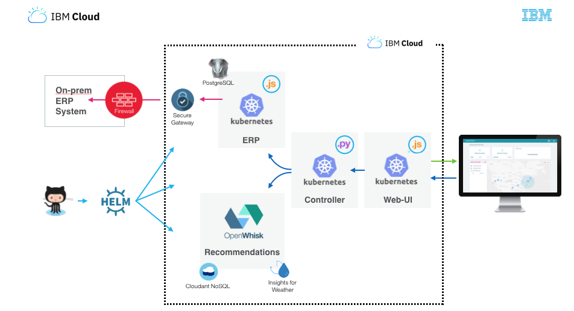

# Logistics Wizard with Kubernetes

This repository is part of the larger [Logistics Wizard](https://github.com/IBM-Cloud/logistics-wizard) project.

## Overview

In this variation of the Logistics Wizard deployment, the ERP and Controller services are deployed as containers within a Kubernetes cluster. The web user interface stays deployed as a Cloud Foundry application.

   

## Prerequisites

- Standard/Paid cluster on [IBM Cloud Kubernetes Service](https://console.bluemix.net/containers-kubernetes/catalog/cluster)
- [Helm](https://docs.helm.sh/using_helm/)
- [kubectl](https://kubernetes.io/docs/tasks/tools/install-kubectl/)

## Deploy

1. Create Standard/Paid cluster on IKS and set up kubectl and run `helm init`
2. Open `logistics-wizard/values.yaml` and update `hosts` field with your Ingress subdomain.
```
  hosts:
    - mycluster-472085.us-south.containers.appdomain.cloud
```
3. Run `helm install --name mylw ./logistics-wizard/`

## Clean up

3. Run `helm delete mylw --purge`
